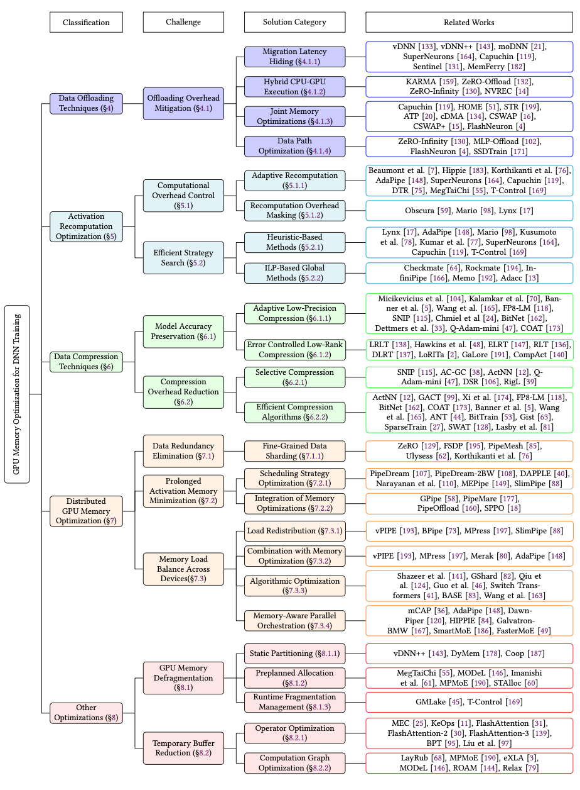

# Survey of GPU Memory Optimization for DNN Training

> A structured survey and paper collection for understanding how modern DNN training systems reduce, move, compress, distribute, and reuse GPU memory.

**English** | [中文](README_zh-CN.md)

## English

### Overview

GPU memory has become one of the main constraints on training modern deep neural networks. Parameters, optimizer states, gradients, activations, communication buffers, and temporary tensors must all share limited device memory. When a model no longer fits, the solution is rarely a single technique: practical systems often combine offloading, recomputation, compression, distributed execution, and memory-management optimizations.

This repository accompanies our survey of **GPU memory optimization for DNN training**. It connects three resources:

1. a taxonomy that explains the field from **classification**, **challenge**, and **solution category** to **related work**;
2. a curated collection of representative papers;
3. a reading path for comparing memory savings against computation, communication, accuracy, and system complexity.

The figure above is the roadmap of the survey. Read it from left to right:

- **Classification** identifies the major family of techniques.
- **Challenge** describes the central problem within that family.
- **Solution Category** groups methods by the mechanism they use.
- **Related Works** provides representative systems and papers discussed in the survey.

### Taxonomy at a glance

#### 1. Data Offloading Techniques (§4)

Offloading extends effective GPU memory capacity by moving tensors between the GPU and external storage tiers such as CPU memory or NVMe SSDs. Its main challenge is that data movement can stall computation and reduce training throughput.

The survey organizes solutions into four directions:

- **Migration Latency Hiding (§4.1.1):** overlap transfers with computation or prefetch data before it is needed. Representative works include vDNN, SuperNeurons, Capuchin, Sentinel, and MemFerry.
- **Hybrid CPU-GPU Execution (§4.1.2):** use CPU and GPU resources jointly instead of treating the host only as passive storage. Representative works include KARMA, ZeRO-Offload, ZeRO-Infinity, and NVREC.
- **Joint Memory Optimizations (§4.1.3):** combine swapping with recomputation, compression, allocation, or scheduling. Representative works include Capuchin, HOME, STR, ATP, cDMA, CSWAP, and FlashNeuron.
- **Data Path Optimization (§4.1.4):** improve the hierarchy and transfer path among GPU memory, host memory, and storage. Representative works include ZeRO-Infinity, MLP-Offload, FlashNeuron, and SSDTrain.

Browse the [19 collected files](papers/Data-Offloading/) in this category.

#### 2. Activation Recomputation Optimization (§5)

Activation recomputation, also known as rematerialization or checkpointing, discards selected intermediate tensors during the forward pass and regenerates them during backpropagation. It saves memory at the cost of additional computation.

The key questions are how to control this overhead and how to choose an efficient recomputation plan:

- **Adaptive Recomputation (§5.1.1):** adapt the checkpointing or recomputation policy to memory pressure, execution state, or pipeline behavior. Representative works include SuperNeurons, Capuchin, DTR, MegTaiChi, T-Control, AdaPipe, and Hippie.
- **Recomputation Overhead Masking (§5.1.2):** hide recomputation in otherwise idle pipeline time or overlap it with other work. Representative works include Obscura, Mario, and Lynx.
- **Heuristic-Based Methods (§5.2.1):** use practical heuristics to find low-cost checkpointing strategies. Representative works include Lynx, AdaPipe, Mario, Kusumoto et al., and T-Control.
- **ILP-Based Global Methods (§5.2.2):** formulate rematerialization as a global optimization problem. Representative works include Checkmate, Rockmate, Infinipipe, Memo, and Adacc.

Browse the [20 collected files](papers/Activation-Recomputation/) in this category.

#### 3. Data Compression Techniques (§6)

Compression reduces the footprint of activations, gradients, optimizer states, or model data through lower precision, quantization, sparsity, or low-rank representations. A useful method must save enough memory to justify encoding and decoding costs while preserving convergence and accuracy.

The survey considers two major challenges:

- **Model Accuracy Preservation (§6.1)**
  - *Adaptive Low-Precision Compression (§6.1.1)* selects suitable numeric formats or precision levels. Representative works include FP8-LM, SNIP, BitNet, Q-Adam-mini, and COAT.
  - *Error-Controlled Low-Rank Compression (§6.1.2)* reduces rank while controlling approximation error. Representative works include GaLore, ELRT, DLRT, LoRITa, and CompAct.
- **Compression Overhead Reduction (§6.2)**
  - *Selective Compression (§6.2.1)* compresses only the tensors that provide a favorable memory-performance trade-off. Representative works include ActNN, GACT, AC-GC, Q-Adam-mini, DSR, and RigL.
  - *Efficient Compression Algorithms (§6.2.2)* reduce metadata, conversion, and runtime costs. Representative works include ActNN, GACT, FP8-LM, BitNet, COAT, ANT, BitTrain, Gist, SparseTrain, and SWAT.

Browse the [31 collected files](papers/Data-Compression/) in this category.

#### 4. Distributed GPU Memory Optimization (§7)

Distributed training introduces both opportunities and new memory bottlenecks. Model states can be sharded across devices, but pipeline schedules may prolong activation lifetimes and unbalanced partitions may leave one device as the memory bottleneck.

The survey groups the solutions by three challenges:

- **Data Redundancy Elimination (§7.1):** fine-grained sharding partitions parameters, gradients, and optimizer states. Representative works include ZeRO, FSDP, PipeMesh, and Ulysses.
- **Prolonged Activation Memory Minimization (§7.2):** scheduling and integrated memory optimizations shorten activation lifetimes. Representative works include PipeDream, DAPPLE, MegTaiChi, SlimPipe, GPipe, PipeMare, PipeOffload, and SPPO.
- **Memory Load Balance Across Devices (§7.3):** redistribute workloads, combine parallelism with memory optimization, improve algorithms, or orchestrate parallel strategies in a memory-aware way. Representative works include vPipe, BPipe, MPress, Merak, AdaPipe, GShard, Switch Transformer, mCAP, HIPPIE, SmartMoE, and FasterMoE.

Browse the [35 collected files](papers/Distributed-Memory-Optimization/) in this category.

#### 5. Other Optimizations (§8)

Some memory bottlenecks are caused neither by model states nor by activations alone. Fragmentation can make free memory unusable, while operator workspaces and intermediate tensors can create large temporary peaks.

- **GPU Memory Defragmentation (§8.1)**
  - *Static Partitioning (§8.1.1)* isolates memory regions or plans reusable pools. Representative works include vDNN++, DyMem, and Coop.
  - *Preplanned Allocation (§8.1.2)* plans tensor placement from known lifetimes. Representative works include MegTaiChi, MODeL, MP-MoE, and STAlloc.
  - *Runtime Fragmentation Management (§8.1.3)* handles changing allocation patterns online. Representative works include GMLake and T-Control.
- **Temporary Buffer Reduction (§8.2)**
  - *Operator Optimization (§8.2.1)* redesigns memory-intensive operators. Representative works include MEC, KeOps, FlashAttention, FlashAttention-2, FlashAttention-3, and BPT.
  - *Computation Graph Optimization (§8.2.2)* changes operator order, graph execution, or memory layout. Representative works include LayRub, MP-MoE, eXLA, MODeL, ROAM, and Relax.

Browse the [21 collected files](papers/Other-Optimizations/) in this category.

### Paper collection

The repository currently contains **126 PDF files**. Some works appear in more than one category because they combine multiple memory-optimization mechanisms; therefore, this number represents files rather than unique papers.

| Category | Coverage | Files | Directory |
| --- | ---: | ---: | --- |
| Data Offloading | 2016-2025 | 19 | [`papers/Data-Offloading`](papers/Data-Offloading/) |
| Activation Recomputation | 2016-2026 | 20 | [`papers/Activation-Recomputation`](papers/Activation-Recomputation/) |
| Data Compression | 2018-2026 | 31 | [`papers/Data-Compression`](papers/Data-Compression/) |
| Distributed Memory Optimization | 2017-2025 | 35 | [`papers/Distributed-Memory-Optimization`](papers/Distributed-Memory-Optimization/) |
| Other Optimizations | 2017-2026 | 21 | [`papers/Other-Optimizations`](papers/Other-Optimizations/) |

### How to use this repository

1. Start with the taxonomy figure to identify the challenge related to your workload.
2. Follow the section number to the corresponding discussion in the survey.
3. Open the category directory and read the foundational work before newer systems.
4. Compare methods along five dimensions: memory savings, computation overhead, communication or I/O overhead, accuracy impact, and implementation complexity.
5. Look for combined techniques when a single optimization is insufficient.

### Contributing

Corrections and new paper suggestions are welcome through GitHub issues or pull requests. When adding a paper, please include its year, venue, title, official or open-access URL, code link if available, and a short explanation of its primary contribution. See [`papers/README.md`](papers/README.md) for the detailed taxonomy and contribution format.

### Citation

If this survey or repository is useful to your work, please cite our paper. The BibTeX entry will be added after publication.

### Copyright notice

Repository-authored content is provided under the license in [`LICENSE`](LICENSE). Copyright of collected papers remains with their authors and publishers. Please use official publisher pages, arXiv records, or author-provided open-access versions and respect the redistribution terms of each paper.

Contact: zjuchenping@zju.edu.cn

